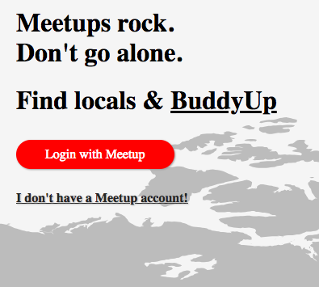

# Buddy Up
-------------------
Buddy-up is a web application that uses the Meetup Api. It allows users with simliar interests on Meetup to chat in real time. This allows our users a chance to have better interactions. Users will also be able to see future events. 

## Contributors
--------------
* Andrew Choi
* Liz Khuu
* Xavier Duncan

Users can login into our application using their meetup accounts. If they don't have one, our users can sign up for one. We integreated the meetup api using passport. 

Once users are logged in, they will see a chat page. The chats are real time using websockets. Once users write their message and press send, they can see everyone elses chats.

If users press the upcoming meetups button, user's can see a list of their upcoming events. The upcomin events are from their meetup profiles. 