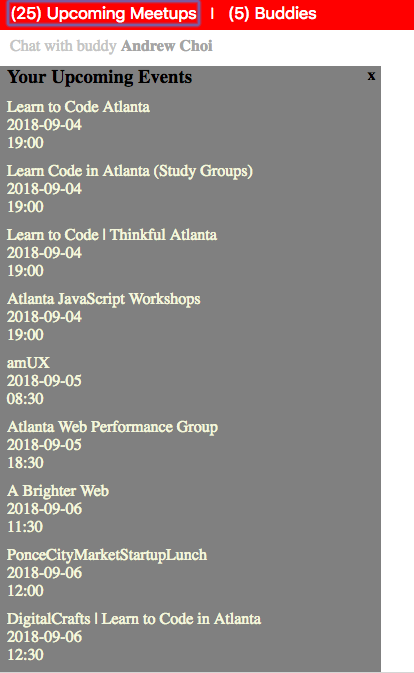

# Buddy Up
-----------
Buddy-up is a web application that focuses on building and creating friendships! Utilizing the Meetup API, we match users based on shared membership within at least one Meetup group. This allows our users to find a buddy based on similar interests and interact with each other by connecting them to a chat session,where they are able to get to know each other in real-time.

## Contributors
---------------
* Andrew Choi
* Liz Khuu
* Xavier Duncan

## Technologies
---------------
* Meetup API
* Passport.js
* Express.js
* WebSockets
* AWS

## About 
---------

### Login

Logging into Buddy-up requires our users to already have a Meetup Account. When users click on the Login button, they are redirected to the Meetup website to input their credentials and allow for our application to access their data. 

No Meetup account? If users not have a Meetup account, they are redirected to the Meetup website to sign up for an account. Afterwards, they are sent back to our application and are ready to go! 

### Find a Buddy

Once users are logged in, they should see a list of their upcoming events from the Meetup groups in which they have membership. Users have the option to click the "Find a Buddy" button that would match them with a user in our system who has similar membership to them in at least one Meetup group. Our application would then initiate a chat session between the two members. 

### Chat

In the initiated buddy chat session, chats are conducted in real-time thanks to WebSockets. Users are able to read and write messages to each other.

### Upcoming Events 

Within the chat session, users are able to click and view a list of their upcoming events.
